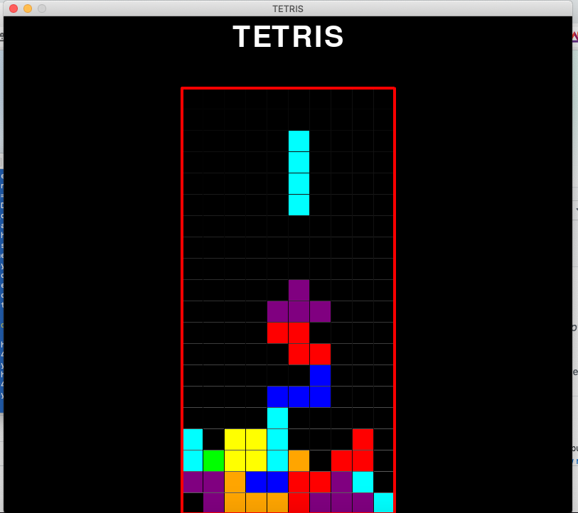

## PYTHON-TETRIS

This very minimal version of tetris made with python was the first project i did back in early 2019, as i had just decided to switch careers into software development.

In fact, to my surprise, game development per se was not that much of a challenge and only needed a few hours, while i had to research for the better part of the weekend just how to run a basic python script, make it work with a 3rd party dependency (here pygame), how to use virtual envs, etc... And why it kept bugging for no apparent reason (turned out to be a compabitility issue between different versions of mac OS and the pygame library...)

It allowed me to grasp basic understanding of the python language and how to run it on MAC

## Content

* The game script : gamev33.py
* The pip requirements : requirements.txt
* 3 bash scripts for hassle-free use

## OS requirements

* It is definitely running as intended on a 10.14.6 Mojave Mac, with python3 (3.7.7),pip (20.2.3) and virtualenv (20.0.31) installed. But i guess it should work fine on other OSes running python

* Be able to run bash script if you want to use those for easy usage

### How to use

* Download ZIP from github and unzip
* Click on scripts in the order they appear // OR // open command line from this folder and do what those scripts do : 
     0. OPTIONAL create virtual env and activate it
     1. install the requirements : `pip3 install -r requirements.txt` (essentially pygame)
     2. `python3 gamev33.py`